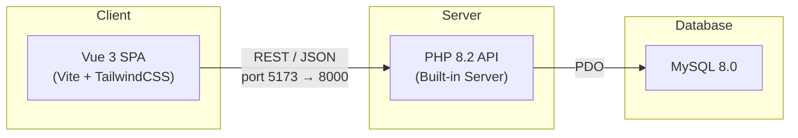
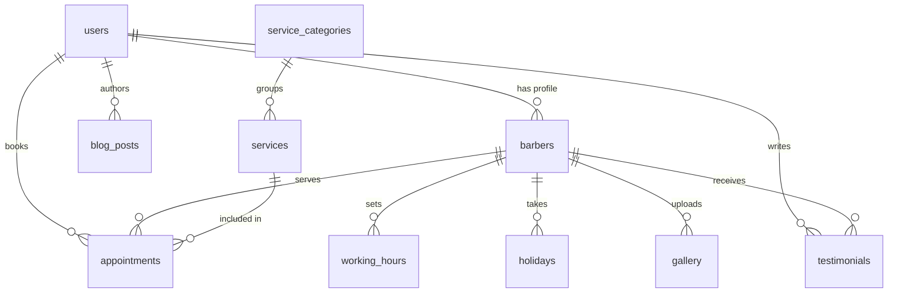

<p align="center">
  <strong style="font-family: 'Playfair Display', serif; font-size: 2.5em; color: #C9A84C;">CandyCutz</strong>
  <br/>
  <em>Premium Grooming · Sharper Standard</em>
</p>

<p align="center">
  
  
  
  
  
  
</p>

---

## 📖 Overview

**CandyCutz** is a full-stack barbing saloon management platform. Customers can browse services, view barber profiles, read blog posts, check the gallery, and book appointments. Staff members manage the shop through role-based admin dashboards.

### Architecture



### Tech Stack

| Layer       | Technology                                                   |
| ----------- | ------------------------------------------------------------ |
| Frontend    | Vue 3, Vue Router, Pinia, Vite 8, TailwindCSS 3, VueUse     |
| Backend     | PHP 8.2 (built-in server), PDO MySQL                         |
| Database    | MySQL 8.0                                                    |
| Auth        | Laravel Sanctum (token-based)                                |
| PWA         | vite-plugin-pwa (offline support, installable)               |
| Fonts       | Inter (body), Playfair Display (headings) — Google Fonts     |
| Deployment  | Docker Compose (dev) · XAMPP (local)                         |

---

## ✨ Features

- **Public Site** — Homepage, services, barber profiles, gallery, blog, testimonials, contact form
- **Booking System** — Date/time slot picker, service + barber selection
- **Role-Based Access** — Super Admin · Admin · Barber · Customer
- **Admin Dashboard** — Manage barbers, services, appointments, blog, gallery, settings
- **Barber Dashboard** — View schedule, manage appointments, upload gallery work
- **Customer Dashboard** — Book appointments, leave reviews, view history
- **Dark Mode** — System-aware with manual toggle
- **PWA** — Installable, offline fallback page, service worker caching
- **Error Pages** — Custom 404, 403, 500, and offline pages with on-brand design

---

## 📋 Prerequisites

### Local / XAMPP

| Requirement | Version  | Notes                                                        |
| ----------- | -------- | ------------------------------------------------------------ |
| PHP         | ≥ 8.2    | With `pdo_mysql` extension enabled                           |
| Node.js     | ≥ 20     | LTS recommended                                              |
| npm         | ≥ 10     | Comes with Node.js                                           |
| MySQL       | ≥ 8.0    | Or MariaDB 10.6+                                             |
| XAMPP       | Optional | Provides PHP + MySQL out of the box                          |

### Docker

| Requirement     | Version |
| --------------- | ------- |
| Docker Engine   | ≥ 24    |
| Docker Compose  | ≥ 2.20  |

---

## 🚀 Quick Start — Local / XAMPP

### 1. Clone the repository

```bash
git clone <repo-url> candycutz
cd candycutz
```

### 2. Create the database

Open **phpMyAdmin** (http://localhost/phpmyadmin) or a MySQL client and create the database:

```sql
CREATE DATABASE candycutz_db CHARACTER SET utf8mb4 COLLATE utf8mb4_unicode_ci;
```

Then run the migration and seed scripts **in order**:

```sql
-- In phpMyAdmin or MySQL CLI, execute these files:
-- 1. barbing-saloon-api/database/migrations/create_tables.sql
-- 2. barbing-saloon-api/database/migrations/fix_gallery_schema.sql
-- 3. barbing-saloon-api/database/migrations/add_images_update.sql
-- 4. barbing-saloon-api/database/migrations/seed_data.sql
-- 5. barbing-saloon-api/database/migrations/seed_data_additional.sql
```

Or use the migration runner:

```bash
cd barbing-saloon-api
php run_migrations.php
```

### 3. Configure environment

**API** — edit `barbing-saloon-api/.env`:

```env
DB_HOST=127.0.0.1
DB_PORT=3306
DB_DATABASE=candycutz_db
DB_USERNAME=root
DB_PASSWORD=
```

**Frontend** — edit `barbing-saloon-web/.env`:

```env
VITE_API_BASE_URL=http://localhost:8000/api
```

### 4. Install frontend dependencies

```bash
cd barbing-saloon-web
npm install
```

### 5. Start the servers

**For Windows Users:**
Simply double-click the `start.bat` file in the root directory! It will automatically open two terminal windows and boot up both the API and the Frontend.

**For Mac/Linux Users (or manual startup):**
Open **two terminals**:

```bash
# Terminal 1 — API server (port 8000)
cd barbing-saloon-api
php -S localhost:8000 -t public

# If PHP is not on PATH (XAMPP on Windows):
C:\xampp\php\php.exe -S localhost:8000 -t public
```

```bash
# Terminal 2 — Frontend dev server (port 5173)
cd barbing-saloon-web
npm run dev
```

### 6. Open the app

Navigate to **http://localhost:5173** 🎉

---

## 🔑 Test Credentials (Default Users)

If you imported the dummy data (`seed_data.sql`), you can use these accounts to demo the system:

| Role         | Email                     | Password      |
| ------------ | ------------------------- | ------------- |
| **Customer** | `customer@candycutz.com`  | `customer123` |
| **Super Admin**| `superadmin@candycutz.com`| *(See Database)* |
| **Admin**    | `admin@candycutz.com`     | *(See Database)* |
| **Barber**   | `marcus@candycutz.com`    | *(See Database)* |

*(You can also register a new account directly from the frontend to test the customer flow).*

---

## 🛠 Troubleshooting

- **500 Database Connection Failed**: Check your `barbing-saloon-api/.env` file. Ensure `DB_DATABASE` is set to `candycutz_db` (or whatever you named it in step 2) and that your MySQL server is running.
- **CORS Issues / Blank Pages**: Ensure the API is running on `port 8000` as the frontend (`barbing-saloon-web/.env`) is strictly configured to communicate with `http://localhost:8000/api`.
- **Changes not showing**: Run `npm run dev` again, or perform a hard refresh (`Ctrl + F5`) in your browser to clear Vite's cache.

---

## 🐳 Quick Start — Docker

### 1. One command

```bash
docker compose up --build
```

This will:
- Start **MySQL 8.0** on port `3306` and auto-run all migration/seed SQL files
- Start the **PHP API** on port `8000`
- Start the **Vite dev server** on port `5173`

### 2. Open the app

Navigate to **http://localhost:5173** 🎉

### Useful Docker commands

```bash
# Start in background
docker compose up -d --build

# View logs
docker compose logs -f

# Stop everything
docker compose down

# Reset database (wipe volume)
docker compose down -v
docker compose up --build
```

---

## 📁 Project Structure

```
candycutz/
├── docker-compose.yml              # Docker orchestration
├── README.md                       # This file
│
├── barbing-saloon-api/             # PHP Backend
│   ├── Dockerfile
│   ├── .env                        # Environment config
│   ├── composer.json               # PHP dependencies
│   ├── run_migrations.php          # DB setup script
│   ├── public/
│   │   └── index.php               # API entry point & router
│   ├── database/
│   │   └── migrations/
│   │       ├── create_tables.sql       # Core schema
│   │       ├── fix_gallery_schema.sql  # Schema patches
│   │       ├── add_images_update.sql   # Image support
│   │       ├── seed_data.sql           # Initial data
│   │       └── seed_data_additional.sql
│   ├── app/                        # Application logic
│   ├── config/                     # Configuration
│   ├── routes/                     # Route definitions
│   ├── storage/                    # Logs, cache, uploads
│   └── vendor/                     # Composer packages
│
├── barbing-saloon-web/             # Vue 3 Frontend
│   ├── Dockerfile
│   ├── .env                        # Frontend env (API URL)
│   ├── package.json
│   ├── vite.config.js              # Vite + PWA config
│   ├── tailwind.config.js          # Design tokens
│   ├── index.html                  # HTML shell
│   └── src/
│       ├── main.js                 # App bootstrap
│       ├── App.vue                 # Root component
│       ├── router/
│       │   └── index.js            # Vue Router setup
│       ├── assets/
│       │   └── css/
│       │       └── main.css        # Global styles + CSS vars
│       ├── core/
│       │   ├── layouts/
│       │   │   └── PublicLayout.vue # Shared header/footer
│       │   ├── components/         # Reusable UI components
│       │   ├── composables/        # Shared composables
│       │   ├── guards/
│       │   │   └── routeGuards.js  # Auth + role guards
│       │   ├── api/                # Axios instances
│       │   └── utils/              # Helpers
│       └── modules/
│           ├── public/             # Public-facing pages
│           │   ├── routes.js
│           │   ├── pages/
│           │   │   ├── HomePage.vue
│           │   │   ├── ServicesPage.vue
│           │   │   ├── BarbersPage.vue
│           │   │   ├── GalleryPage.vue
│           │   │   ├── BlogPage.vue
│           │   │   ├── TestimonialsPage.vue
│           │   │   ├── ContactPage.vue
│           │   │   ├── NotFoundPage.vue      # 404
│           │   │   ├── ForbiddenPage.vue     # 403
│           │   │   ├── ServerErrorPage.vue   # 500
│           │   │   └── OfflinePage.vue       # PWA offline
│           │   └── api/
│           ├── auth/               # Login, register, dashboard
│           ├── customer/           # Customer portal
│           ├── barber/             # Barber portal
│           ├── admin/              # Admin dashboard
│           └── superadmin/         # Super admin panel
```

---

## ⚙️ Environment Variables

### API (`barbing-saloon-api/.env`)

| Variable          | Default             | Description                              |
| ----------------- | ------------------- | ---------------------------------------- |
| `APP_NAME`        | `CandyCutz`         | Application name                         |
| `APP_ENV`         | `local`             | Environment (`local`, `production`)      |
| `APP_DEBUG`       | `true`              | Enable debug output                      |
| `APP_URL`         | `http://localhost:8000` | Base URL of the API                  |
| `DB_CONNECTION`   | `mysql`             | Database driver                          |
| `DB_HOST`         | `127.0.0.1`         | Database host (`db` in Docker)           |
| `DB_PORT`         | `3306`              | Database port                            |
| `DB_DATABASE`     | `candycutz_db`      | Database name                            |
| `DB_USERNAME`     | `root`              | Database user                            |
| `DB_PASSWORD`     | *(empty)*           | Database password (`secret` in Docker)   |
| `MAIL_MAILER`     | `log`               | Mail driver (log for local dev)          |

### Frontend (`barbing-saloon-web/.env`)

| Variable              | Default                       | Description          |
| --------------------- | ----------------------------- | -------------------- |
| `VITE_API_BASE_URL`   | `http://localhost:8000/api`   | Backend API base URL |

---

## 🗄️ Database

### Schema Overview



### Tables

| Table                    | Purpose                                        |
| ------------------------ | ---------------------------------------------- |
| `users`                  | All users (customer, barber, admin, super_admin)|
| `barbers`                | Barber profiles linked to users                 |
| `services`               | Available services with pricing                 |
| `service_categories`     | Service groupings                               |
| `appointments`           | Booking records                                 |
| `working_hours`          | Per-barber weekly schedule                      |
| `holidays`               | Barber days off                                 |
| `gallery`                | Portfolio images                                |
| `testimonials`           | Customer reviews (admin-approved)               |
| `blog_posts`             | Blog articles                                   |
| `settings`               | Key-value app settings                          |
| `audit_logs`             | Action tracking                                 |
| `personal_access_tokens` | Sanctum auth tokens                             |

---

## 🔌 API Endpoints

All endpoints are prefixed with `/api`.

### Public (no auth required)

| Method | Path                      | Description                  |
| ------ | ------------------------- | ---------------------------- |
| GET    | `/public/settings`        | App settings (name, etc.)    |
| GET    | `/public/services`        | Available services           |
| GET    | `/public/barbers`         | Available barbers            |
| GET    | `/public/gallery`         | Gallery images               |
| GET    | `/public/testimonials`    | Approved testimonials        |
| GET    | `/public/service-categories` | Service categories        |
| GET    | `/public/blog`            | Published blog posts         |
| GET    | `/public/working-hours`   | Barber schedules             |
| GET    | `/public/available-slots` | Time slots for booking       |
| POST   | `/public/contact`         | Submit contact form          |

---

## 🎨 Design System

The design uses a **luxury barber aesthetic** — dark obsidian backgrounds with gold accents.

### Color Palette

| Name       | Hex       | Usage                     |
| ---------- | --------- | ------------------------- |
| Obsidian   | `#0D0D0D` | Dark background           |
| Charcoal   | `#1A1A1A` | Dark surfaces             |
| Steel      | `#2A2A2A` | Elevated dark surfaces    |
| Graphite   | `#3D3D3D` | Borders (dark mode)       |
| Gold       | `#C9A84C` | Primary accent            |
| Gold Light | `#E8C96A` | Hover states              |
| Gold Dark  | `#A8862E` | Pressed states            |
| Ivory      | `#FAFAF8` | Light background          |
| Cream      | `#F0EDE6` | Light surfaces            |

### Typography

- **Headings**: Playfair Display (600–800 weight)
- **Body**: Inter (400–800 weight)

---

## 🧑‍💻 Development

### Frontend dev server

```bash
cd barbing-saloon-web
npm run dev          # http://localhost:5173
```

### Build for production

```bash
cd barbing-saloon-web
npm run build        # Output → dist/
npm run preview      # Preview the production build
```

### Code Structure Conventions

- **Pages** go in `src/modules/<module>/pages/`
- **Routes** are defined per-module in `src/modules/<module>/routes.js`
- **Shared components** live in `src/core/components/`
- **API services** are in `src/modules/<module>/api/` or `src/core/api/`
- **CSS variables** for theming are in `src/assets/css/main.css`
- **Tailwind tokens** are extended in `tailwind.config.js`

---

## 🤝 Contributing

1. **Fork** the repository
2. **Create** a feature branch: `git checkout -b feature/my-feature`
3. **Commit** with clear messages: `git commit -m "feat: add barber scheduling"`
4. **Push** to your fork: `git push origin feature/my-feature`
5. **Open** a Pull Request

### Commit Convention

Use [Conventional Commits](https://www.conventionalcommits.org/):

| Prefix     | Use case             |
| ---------- | -------------------- |
| `feat:`    | New feature          |
| `fix:`     | Bug fix              |
| `docs:`    | Documentation        |
| `style:`   | Code formatting      |
| `refactor:`| Code restructuring   |
| `chore:`   | Build/tooling        |

---

## 📄 License

This project is proprietary. All rights reserved.

---

<p align="center">
  <strong>CandyCutz</strong> · Built with 💈 and ☕
</p>
