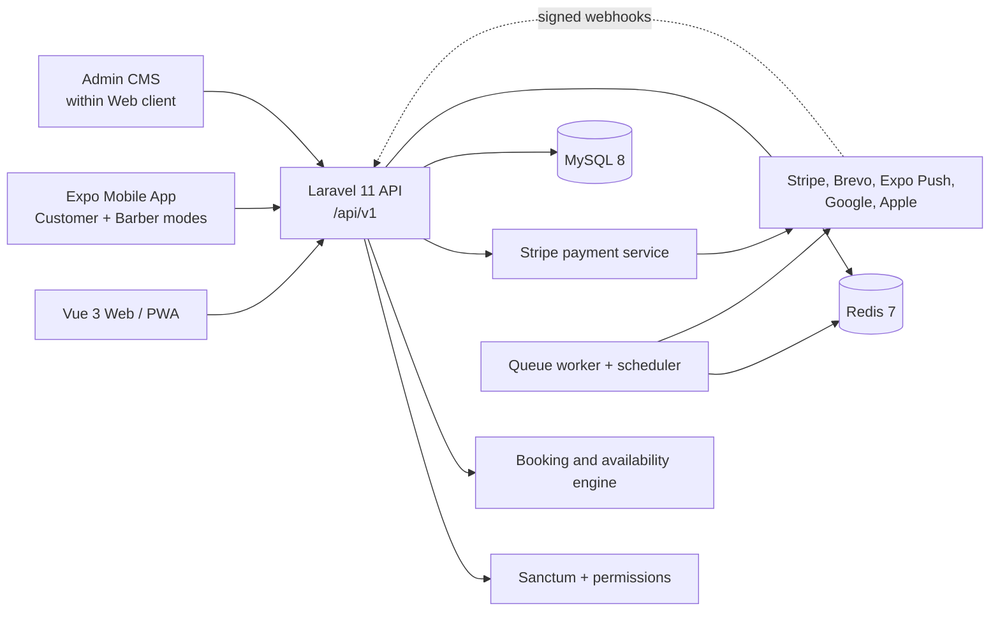

# CandyCutz

**CandyCutz** is a unified grooming and barbing platform for a commercial salon in Keffi, Nasarawa State, Nigeria. It connects customers, barbers, shop operators, and business owners through one authoritative booking, payment, communication, and content-management system.

The product supports both appointments at the CandyCutz shop and on-demand home-service grooming. Customers discover services and barbers, choose a time, pay securely, and track their appointments. Barbers manage their queue and schedule. Admins run daily operations, while super admins control the catalog, users, policies, branding, and audit history.

## What This Project Contains

CandyCutz is one platform with multiple clients and one backend:

- **Laravel 11 API**: The source of truth for identity, permissions, services, availability, bookings, payments, notifications, and audit records.
- **Vue 3 web application**: The public website, customer portal, barber portal, admin dashboard, super-admin controls, and installable PWA experience.
- **One Expo mobile application**: A native React Native application with role-based navigation for both customers and barbers. It is not a WebView wrapper.
- **CMS and Theme Studio**: Operational content management and controlled branding changes with draft, preview, publish, and rollback workflows.
- **Single MySQL database**: All clients use the same relational data model through versioned API contracts.
- **Redis infrastructure**: Used for cache, sessions, queues, and asynchronous work.

The intended topology is:


```mermaid
flowchart LR
    Web[Vue 3 Web / PWA]
    Mobile[Expo Mobile App\nCustomer + Barber modes]
    CMS[Admin CMS\nwithin Web client]
    API[Laravel 11 API\n/api/v1]
    Auth[Sanctum + permissions]
    Booking[Booking and availability engine]
    Payment[Stripe payment service]
    DB[(MySQL 8)]
    Redis[(Redis 7)]
    Worker[Queue worker + scheduler]
    External[Stripe, Brevo, Expo Push,\nGoogle, Apple]

    Web --> API
    Mobile --> API
    CMS --> API
    API --> Auth
    API --> Booking
    API --> Payment
    API --> DB
    API --> Redis
    Worker --> Redis
    Worker --> External
    Payment --> External
    External -. signed webhooks .-> API
```

## Product Capabilities

### Customer experience

- Browse services, categories, prices, durations, barbers, specialties, gallery work, testimonials, and grooming content.
- Select a preferred barber and an authoritative available time slot.
- Book either **in-shop** or **home-service** appointments.
- Save multiple home or office addresses, including landmarks and coordinates.
- Pay at the shop, pay a configured deposit, or pay in advance through Stripe.
- View upcoming appointments and history, reschedule or cancel within policy, and submit reviews.
- Receive transactional email and mobile push notifications.
- Use the web client or the customer mode of the native mobile app.

### Barber experience

- View the daily queue, upcoming calendar, appointment details, and operational statistics.
- Move appointments through check-in, in-progress, completed, and no-show states.
- Handle walk-ins, personal blocked periods, working hours, and availability.
- Maintain a public profile with biography, specialties, avatar, and portfolio images.
- Receive customer and appointment alerts through the mobile app and notification services.

### Admin and business operations

- Monitor appointment volume, chair occupancy, revenue, staff, and customer activity.
- Manage services, categories, pricing, duration, barber assignments, schedules, holidays, and service zones.
- Manage home-service fees and coverage across Keffi zones.
- Publish and moderate gallery items, testimonials, blog content, banners, FAQs, and announcements.
- Reassign or override operational records when authorized, with an audit reason.

### Super-admin controls

- Manage users, roles, permissions, platform settings, and sensitive operational policies.
- Control the Theme Studio and its draft, preview, publish, and rollback lifecycle.
- Inspect the immutable audit trail for privileged actions.
- Retain historical appointments, financial records, and audit data when accounts are deactivated.

## Core Business Rules

### Authoritative booking availability

Availability is calculated by the backend, never trusted from a client. The engine considers:

- Branch business hours, holidays, barber working hours, and days off.
- Existing appointments and blocked periods.
- The combined duration of multiple services and cleanup buffers.
- Extra travel buffers for home-service appointments.
- Service-zone eligibility and travel fees.

Booking creation runs inside an ACID transaction and locks overlapping appointment rows before inserting a new booking. A race for the same slot returns a conflict instead of producing a double booking.

The normal appointment lifecycle is:

```text
pending -> confirmed -> checked_in -> in_progress -> completed
                              \\-> cancelled
                              \\-> no_show
```

### Home-service privacy and pricing

Customers can choose a saved address in an enabled service zone. The server calculates the travel charge from the configured zone and distance rules. The customer's exact location is protected from the barber until the configured disclosure window before the appointment.

### Payments

Stripe is used for card and supported wallet payments. The client never determines whether a payment succeeded. The backend verifies signed Stripe webhooks, rejects duplicate event processing, updates the appointment and ledger, and dispatches receipts and notifications asynchronously.

### Reliable mutations on unstable networks

Mobile mutations such as bookings and payment initialization use idempotency keys. A retry caused by a weak connection can return the original result instead of creating a second booking or payment attempt.

### Identity and authorization

Laravel Sanctum is the authentication authority for web and mobile clients. Roles and permissions are enforced by the backend. The supported account roles are:

- `customer`
- `barber`
- `admin`
- `super_admin`

Login issues client-scoped tokens; standard login must not delete all of a user's other active tokens. Customer deactivation is soft deactivation so financial and operational history remains intact.

## Technology Stack

| Area | Technologies |
| --- | --- |
| Backend | PHP 8.2, Laravel 11, Laravel Sanctum, Spatie permissions |
| Web | Vue 3.5, Vue Router, Pinia, Axios, Vite 8, Tailwind CSS, Vite PWA |
| Mobile | Expo SDK 57, React Native 0.86, TypeScript, Expo Router |
| Client state | TanStack Query for server state, Zustand for lightweight client state |
| Data | MySQL 8.0, Redis 7.2, InnoDB transactions |
| Payments | Stripe PaymentIntents and signed webhooks |
| Notifications | Brevo transactional email, Expo Push Notifications |
| Authentication integrations | Laravel Sanctum, Google OAuth/JWKS, Apple identity keys |
| Infrastructure | Nginx, PHP-FPM, Docker Compose, queue worker, scheduler |

## Repository Map

```text
candycutz/
├── barbing-saloon-api/       # Authoritative Laravel 11 backend
│   ├── app/                  # Domain logic, services, requests, resources
│   ├── routes/               # Web, legacy compatibility, and API routes
│   ├── database/             # Migrations, factories, seeders
│   ├── config/               # Laravel and integration configuration
│   ├── tests/                # Backend tests
│   └── public/               # Laravel public entry point
├── barbing-saloon-web/       # Vue 3 web client, PWA, portals, and CMS
│   ├── src/core/             # Shared API, layouts, guards, components
│   └── src/modules/          # Public, auth, customer, barber, admin modules
├── candycutz-mobile-app/     # One Expo app with customer/barber role flows
│   ├── app/                  # Expo Router screens and layouts
│   └── src/                  # API, state, types, and shared mobile code
├── infrastructure/           # Nginx, PHP, MySQL, and deployment definitions
├── docs/                     # Product, architecture, API, security, and runbooks
├── docker-compose.yml        # Nginx, Laravel, worker, scheduler, MySQL, Redis
├── BUILD_PLAN.md             # Milestones and dependency tracking
├── PROJECT_STATE.md          # Current implementation state
└── TASKS.md                  # Active engineering tasks
```

## API Contract

New clients use the versioned API namespace:

```text
/api/v1/
```

Responses use a consistent envelope:

```json
{
  "success": true,
  "message": "Appointment confirmed successfully",
  "data": {},
  "meta": {}
}
```

The main API domains are:

| Domain | Purpose |
| --- | --- |
| `/api/v1/auth` | Registration, login, social login, profile identity, deactivation |
| `/api/v1/public` | Services, barbers, theme, gallery, blog, testimonials, slots, zones |
| `/api/v1/customer` | Bookings, addresses, profile, reviews, device tokens |
| `/api/v1/barber` | Queue, appointment status, walk-ins, schedule, portfolio |
| `/api/v1/payments` | Payment initialization, status, and Stripe webhooks |
| `/api/v1/admin` | Operations, catalog, zones, users, Theme Studio, audit logs |

The existing web client compatibility routes remain supported while clients migrate to the versioned contract. See [docs/API.md](docs/API.md) for the complete endpoint specification and rate limits.

## Local Development

### Requirements

- PHP 8.2 with `pdo_mysql` enabled
- Composer
- Node.js 20 or newer and npm
- MySQL 8.0 or compatible MariaDB
- Expo CLI and an Android/iOS development environment for mobile work
- Docker Desktop, if using the containerized stack

### Option 1: XAMPP or native services

1. Create a MySQL database named `candycutz_db`.
2. Configure `barbing-saloon-api/.env` with the database, application, mail, Stripe, and Redis values needed for your environment.
3. Install backend dependencies:

   ```powershell
   cd barbing-saloon-api
   composer install
   php artisan key:generate
   php artisan migrate --seed
   ```

4. Install and configure the web client:

   ```powershell
   cd ..\barbing-saloon-web
   npm install
   ```

   Set `VITE_API_BASE_URL` to the API base URL, normally `http://localhost:8000/api` for local development.

5. Start the API and web client in separate terminals:

   ```powershell
   # Terminal 1
   cd barbing-saloon-api
   php artisan serve --host=127.0.0.1 --port=8000

   # Terminal 2
   cd barbing-saloon-web
   npm run dev
   ```

   On Windows with XAMPP, use `C:\xampp\php\php.exe` in place of `php` if PHP is not on `PATH`.

The root convenience command also starts the local API and web client in separate Windows terminals:

```powershell
npm run dev
```

### Option 2: Docker Compose

The Compose topology is the closest representation of the intended deployment architecture. Build the web bundle first because Nginx serves the generated `barbing-saloon-web/dist` directory:

```powershell
cd barbing-saloon-web
npm install
npm run build

cd ..
docker compose up --build
```

The stack includes:

- Nginx as the public ingress and static web server
- Laravel PHP-FPM application server
- Redis-backed queue worker for email and push jobs
- Laravel scheduler for reminders and recurring tasks
- MySQL 8.0
- Redis 7.2 for cache, sessions, and queues

Useful commands:

```powershell
docker compose up -d --build
docker compose logs -f app worker scheduler
docker compose down
docker compose down -v  # Deletes local database and Redis volumes
```

Do not use `docker compose down -v` unless you intentionally want to remove local persisted data.

### Mobile development

The mobile package is one role-aware application. It selects customer or barber navigation from the authenticated user's backend role.

```powershell
cd candycutz-mobile-app
npm install
npm run type-check
npm start
```

Use `npm run android`, `npm run ios`, or `npm run web` for the corresponding target. Configure the mobile API URL through the app's environment/configuration mechanism; do not hard-code a host IP in application code. Authentication tokens belong in `expo-secure-store`, not plain local storage.

## Configuration and Secrets

Never commit real credentials. Use environment variables for:

- Laravel application key and environment settings
- MySQL and Redis connection details
- Sanctum stateful domains and CORS origins
- Stripe publishable key, secret, and webhook secret
- Brevo SMTP/API credentials
- Expo push credentials
- Google and Apple identity-provider settings
- Production media storage credentials

For production, use `APP_DEBUG=false`, HTTPS, restricted CORS origins, private infrastructure ports, encrypted secret storage, database backups, and monitored queue workers. The deployment guidance is in [docs/Deployment.md](docs/Deployment.md).

## Engineering Rules

- Keep Laravel as the only authority for authorization, pricing, availability, and payment state.
- Put validation in Form Requests and complex business logic in focused service classes.
- Protect booking writes with transactions and row-level locking.
- Use API Resources or the standard response envelope for client-facing data.
- Preserve the existing Vue web client and compatibility routes while extending the platform.
- Use idempotency for retryable financial and booking mutations.
- Record privileged administrative changes in the audit log.
- Do not create a second backend, database, or mobile application.
- Do not store raw secrets, plain-text passwords, or mobile tokens in source control.

## Documentation Guide

The `docs/` directory is the working system specification:

- [Architecture](docs/Architecture.md): platform topology and subsystem boundaries
- [API](docs/API.md): versioned endpoint contract and response format
- [PRD](docs/PRD.md): personas, product requirements, and business behavior
- [Authentication](docs/Authentication.md): identity and access rules
- [Booking Engine](docs/Booking-Engine.md): slot calculation and concurrency behavior
- [Payments](docs/Payments.md): Stripe, ledger, and webhook behavior
- [Mobile](docs/Mobile.md): Expo application architecture
- [Security](docs/Security.md): security requirements and controls
- [Deployment](docs/Deployment.md): infrastructure and release procedures
- [Testing](docs/Testing.md): verification strategy

For the current implementation phase and outstanding work, read [PROJECT_STATE.md](PROJECT_STATE.md), [BUILD_PLAN.md](BUILD_PLAN.md), and [TASKS.md](TASKS.md).

## Project Status

CandyCutz is an actively developed platform. The repository contains the existing Vue web experience, Laravel backend, unified Expo mobile client, infrastructure definitions, and evolving API v1 architecture. Some integrations and operational workflows may require environment credentials, migrations, or additional implementation before production launch. Treat the project state and task documents as the authoritative status indicators.

## License

CandyCutz is proprietary software. All rights reserved.
