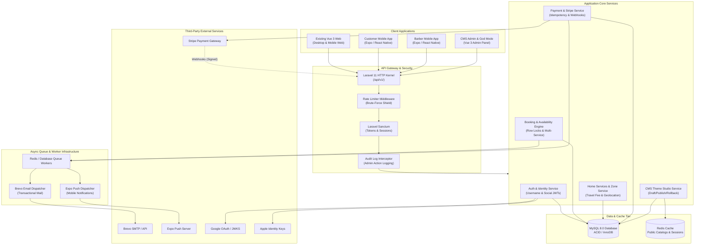

# Candycutz — System Architecture Document

## 1. Architectural Principles & Vision
Candycutz is architected as a **Unified Headless Platform**:
- **Single Source of Truth**: The Laravel 11 backend is the sole authoritative authority for business rules, slot availability, payment confirmation, and data storage.
- **Client Agnostic**: The existing Vue 3 Web Application, the Customer Expo Mobile Application, the Barber Expo Mobile Application, and the Admin CMS are peer clients communicating over a secure, versioned REST API (`/api/v1/`).
- **No WebView Wrappers**: Mobile applications are natively compiled using React Native and Expo for optimal performance and native OS integration.
- **Event-Driven Asynchronous Processing**: Email delivery (Brevo), push notifications (Expo), and webhooks (Stripe) are decoupled from HTTP request cycles via queues.

---

## 2. Platform Architecture Diagram



---

## 3. Subsystem Breakdown

### 3.1 Authoritative Backend (Laravel 11)
- **Framework**: Laravel 11.54 with lean configuration in `bootstrap/app.php`.
- **Modular Service Layer**: Business logic resides in dedicated services (`App\Services\Booking\*`, `App\Services\Payment\*`, etc.) rather than bloated controllers.
- **Form Requests**: 100% of input validation occurs within dedicated Request classes (`StoreBookingRequest`, `UpdateProfileRequest`, etc.).
- **Response Standardization**: Uniform JSON envelopes enforced via `App\Core\Http\Response\ApiResponse`:
  ```json
  {
    "success": true,
    "message": "Appointment confirmed successfully",
    "data": { ... },
    "meta": { ... }
  }
  ```

### 3.2 Existing Web Client (Vue 3 / Vite)
- Preserved without destructive changes.
- Consumes API v1 routes through configured Axios client (`src/core/api/axios.js`).
- PWA capabilities maintained via `vite-plugin-pwa` with local asset caching.

### 3.3 Customer & Barber Mobile Applications (Expo React Native)
- **Framework**: React Native 0.74+, Expo SDK 51+, TypeScript.
- **Routing**: File-based navigation via Expo Router v3.
- **Server State**: TanStack Query (React Query v5) for declarative fetching, caching, optimistic updates, and background refetching.
- **Client State**: Zustand for session, theme mode, and lightweight UI states.
- **Token Security**: `expo-secure-store` for cryptographic storage of bearer tokens.
- **Styling**: NativeWind v4 paired with centralized design tokens matching the CMS Theme Studio.

---

## 4. Cross-Cutting Concerns

### 4.1 High-Concurrency Booking & Race-Condition Defense
To guarantee that two users attempting to book the same barber slot simultaneously never result in a double-booking:
1. The incoming booking request initiates an ACID database transaction.
2. The availability engine executes a pessimistic lock:
   ```sql
   SELECT id, appointment_date, start_time, end_time 
   FROM appointments 
   WHERE barber_id = :barberId 
     AND appointment_date = :date 
     AND status NOT IN ('cancelled')
     AND (start_time < :requestedEndTime AND end_time > :requestedStartTime)
   FOR UPDATE;
   ```
3. If any overlapping row exists, the transaction rolls back immediately and returns HTTP 409 Conflict with `SLOT_UNAVAILABLE`.
4. If clear, the appointment and related `appointment_items` are inserted atomically.

### 4.2 Network Resilience in Emerging Markets
Operating in Nigeria necessitates resilience against intermittent mobile network connectivity:
- Read-heavy data (services, barber bios, pricing, gallery) is cached on mobile clients using TanStack Query with 24-hour garbage collection.
- Mutating operations (booking submission, payment initialization) enforce **Idempotency Keys** generated on the client (UUID v4) and passed in the `X-Idempotency-Key` header.
- The server checks the key in `payment_transactions` and cached requests; if a retried request with an existing key arrives, the previous successful response is returned without re-executing transactions.

### 4.3 Stripe Webhook Reconciliation
1. Customer initiates payment; server creates Stripe `PaymentIntent` with metadata: `{ "appointment_draft_id": "...", "customer_id": "..." }`.
2. Customer completes payment via Stripe mobile sheet or web checkout.
3. Stripe dispatches signed webhook event `payment_intent.succeeded`.
4. Laravel `StripeWebhookController` verifies cryptographic signature using `STRIPE_WEBHOOK_SECRET`.
5. System checks for duplicate processing via `stripe_event_id` in `payment_transactions`.
6. System updates appointment to `confirmed`, dispatches Brevo receipt email, and sends push notification to barber.
