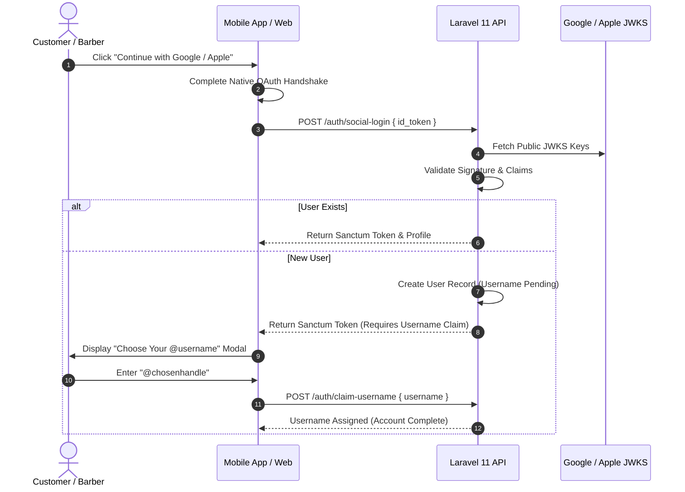

# Candycutz — Authentication & Identity Architecture

## 1. Core Identity Philosophy: Username-First
Every user in the Candycutz ecosystem possesses:
- **`username`**: The public, display identity (e.g. `@johndoe`, `@marcus_cuts`). Used in reviews, appointment queues, and community interactions.
- **`real_name`**: Stored privately for payment receipts, legal identification, and administrative compliance.
- **`email`**: Unique communication anchor for transactional receipts and password recovery.
- **`phone`**: SMS reminders and operational dispatch.

### 1.1 Username Rules & Validation
1. Format: 3 to 30 characters; lowercase alphanumeric with underscores and hyphens (`^[a-zA-Z0-9_-]{3,30}$`).
2. Case-Insensitive Uniqueness: Stored lowercase; duplicate queries verify `LOWER(username)`.
3. Reserved Handles: System reserves administrative handles (`admin`, `superadmin`, `candycutz`, `support`, `root`, `barber`, `keffi`, `billing`).
4. Rate of Change: Users may change their username at most once every **90 days**.
   - Tracked via `users.last_username_change_at`.
   - Super Admin can bypass this 90-day restriction at any time via God Mode.
5. No Monetization: Usernames are completely free; no premium handles or fees.

---

## 2. Authentication Methods & Flows

### 2.1 Direct Registration & Login
- Registration accepts `real_name`, `username`, `email`, `password`, and optional `phone`.
- Passwords hashed using bcrypt (cost 12) or Argon2id.
- Returns a Sanctum Personal Access Token (`candycutz_token_...`).

### 2.2 Social Authentication (Google & Apple)
1. Mobile app or web client initiates native SDK sign-in (Google Sign-In or Apple Sign-In).
2. Client receives identity token (ID Token) and transmits it to `POST /api/v1/auth/social-login`.
3. Server executes server-side cryptographic validation:
   - Fetches official public keys from JWKS endpoints:
     - Google: `https://www.googleapis.com/oauth2/v3/certs`
     - Apple: `https://appleid.apple.com/auth/keys`
   - Validates RS256 signature, expiry (`exp`), and audience (`aud`).
4. **Post-Social Onboarding**:
   - If user is new, an account is created with `auth_provider = 'google'|'apple'`.
   - The user is flagged with `status = 'username_pending'`.
   - The user is prompted immediately to select a unique `@username`.
   - The user cannot book appointments or post reviews until the username is claimed.

---

## 3. Account Lifecycle & Soft Deactivation

### 3.1 Customer Deactivation Flow
- Customers can deactivate their account via Profile Settings (`DELETE /api/v1/auth/deactivate`).
- Customer sees: *"Your account has been deleted."*
- **Internal Database State**:
  - `is_active = FALSE`
  - `status = 'deactivated'`
  - `deactivated_at = NOW()`
  - Personal access tokens immediately revoked.
- **Historical Retention**:
  - Appointments, payment transactions, reviews, and audit logs are **never deleted**.
  - Username is locked for 180 days to prevent impersonation.
- **Super Admin Restoration**:
  - Super Admin can locate the deactivated account in the God-Mode Admin Panel and click "Reactivate Account", restoring full access.

---

## 4. Mobile Token Security
- On iOS: Bearer tokens are stored in the hardware-backed iOS Keychain via `expo-secure-store`.
- On Android: Bearer tokens are stored in encrypted `SharedPreferences` backed by the Android Keystore system.
- Tokens are injected automatically into outgoing API requests via Axios interceptors:
  `Authorization: Bearer <sanctum_token>`
- If an HTTP 401 Unauthorized is returned, the app clears the token, resets the Zustand session state, and seamlessly routes the user to the Welcome / Login screen.
