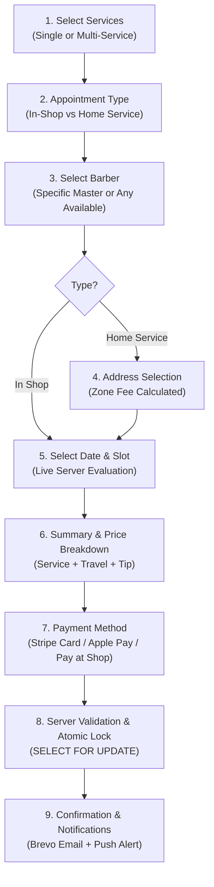

# Candycutz — Booking Engine & Scheduling Architecture

## 1. Overview
The booking engine is the operational heart of Candycutz. It coordinates barber availability, shop opening hours, multi-service duration, travel buffers, and high-concurrency reservation locking.

---

## 2. Booking Flow & Stepper



---

## 3. Server-Side Availability Calculation

Clients are never trusted to calculate slot availability. The server evaluates:
$$\text{Total Duration} = \sum_{i} \text{ServiceDuration}_i + \text{ShopBuffer} + \text{HomeTravelBuffer}$$

### 3.1 Availability Evaluation Parameters
1. **Branch Hours**: Must fall within `business_hours` for the specified `branch_id`.
2. **Shop Holidays**: Date must not exist in `holidays` for the branch.
3. **Barber Working Hours**: Barber must have active `barber_availability` on that day of the week.
4. **Existing Bookings**: No overlapping appointment where `status NOT IN ('cancelled')`.
5. **Blocked Periods**: Slot must not intersect any personal breaks or administrative blocks in `blocked_periods`.
6. **Travel Buffers (Home Service)**: Adds 30 minutes of transit buffer before and after the service window on the barber's schedule.

### 3.2 Dynamic Slot Generation Algorithm
```php
public function getAvailableSlots(Carbon $date, int $barberId, int $totalDurationMinutes, bool $isHomeService): array
{
    // 1. Fetch working hours for this barber on given day of week
    $schedule = BarberAvailability::where('barber_id', $barberId)
        ->where('day_of_week', $date->dayOfWeek)
        ->where('is_available', true)
        ->first();

    if (!$schedule) return [];

    $start = $date->copy()->setTimeFromTimeString($schedule->start_time);
    $end = $date->copy()->setTimeFromTimeString($schedule->end_time);

    // 2. Fetch existing appointments and blocked periods
    $existing = Appointment::where('barber_id', $barberId)
        ->where('appointment_date', $date->toDateString())
        ->whereNotIn('status', ['cancelled'])
        ->get(['start_time', 'end_time']);

    $blocked = BlockedPeriod::where('barber_id', $barberId)
        ->whereDate('start_datetime', $date->toDateString())
        ->get(['start_datetime', 'end_datetime']);

    $slots = [];
    $slotInterval = 30; // 30-minute stepping
    $cursor = $start->copy();

    while ($cursor->copy()->addMinutes($totalDurationMinutes)->lte($end)) {
        $slotEnd = $cursor->copy()->addMinutes($totalDurationMinutes);
        
        $hasConflict = false;
        foreach ($existing as $app) {
            if ($cursor->toTimeString() < $app->end_time && $slotEnd->toTimeString() > $app->start_time) {
                $hasConflict = true;
                break;
            }
        }

        if (!$hasConflict) {
            foreach ($blocked as $b) {
                if ($cursor->toDateTimeString() < $b->end_datetime && $slotEnd->toDateTimeString() > $b->start_datetime) {
                    $hasConflict = true;
                    break;
                }
            }
        }

        if (!$hasConflict) {
            $slots[] = $cursor->format('H:i');
        }

        $cursor->addMinutes($slotInterval);
    }

    return $slots;
}
```

---

## 4. Concurrency Collision Prevention (Pessimistic Locking)

To guarantee that two users cannot book the same slot simultaneously:
```php
DB::transaction(function () use ($request, $user) {
    // 1. Lock the barber's schedule for that date
    $conflict = Appointment::where('barber_id', $request->barber_id)
        ->where('appointment_date', $request->date)
        ->whereNotIn('status', ['cancelled'])
        ->where(function ($q) use ($request) {
            $q->where('start_time', '<', $request->end_time)
              ->where('end_time', '>', $request->start_time);
        })
        ->lockForUpdate() // PESSIMISTIC ROW LOCK
        ->exists();

    if ($conflict) {
        throw new SlotUnavailableException('This slot was just claimed by another customer.');
    }

    // 2. Create the appointment atomically
    $appointment = Appointment::create([
        'booking_reference' => 'CC-' . strtoupper(Str::random(8)),
        'customer_id' => $user->id,
        'barber_id' => $request->barber_id,
        'appointment_type' => $request->type, // in_shop or home_service
        'appointment_date' => $request->date,
        'start_time' => $request->start_time,
        'end_time' => $request->end_time,
        'total_duration_minutes' => $request->total_duration,
        'grand_total' => $request->grand_total,
        'status' => 'pending',
    ]);

    // 3. Attach multi-service items
    foreach ($request->services as $service) {
        $appointment->items()->create([
            'service_id' => $service['id'],
            'price' => $service['price'],
            'duration_minutes' => $service['duration_minutes'],
        ]);
    }

    return $appointment;
});
```

---

## 5. Rescheduling, Cancellations & No-Shows

| Scenario | Policy Rules | Execution |
|---|---|---|
| **Rescheduling** | Permitted up to 2 hours prior to slot. Max 2 self-reschedules. | Atomically releases current slot, applies lock on new slot, records change in `appointment_status_history`. |
| **Cancellation** | Full refund / deposit credit if cancelled $\ge$ 4 hours prior. | Status set to `cancelled`, slot released, automated Stripe refund triggered via job queue. |
| **Late Cancellation** | < 4 hours prior to appointment. | Deposit forfeited according to CMS policy settings; client notified. |
| **No-Show** | Client fails to arrive within 15 minutes of appointment start time. | Barber marks `no_show`. Account no-show tally increments; 3 strikes mandate full advance payment for future bookings. |
| **Walk-In Entry** | In-person client enters the shop. | Barber or Admin taps "Walk-In", enters customer name, and immediately locks the chair for the required duration. |
