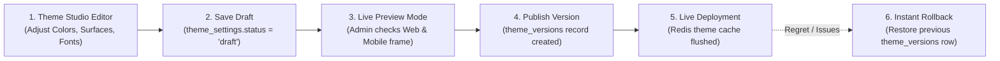

# Candycutz — CMS Control Plane & Theme Studio

## 1. CMS-First Principle
Candycutz is an operationally dynamic, CMS-controlled platform. The CMS Admin Panel is not merely an inspection viewer; it is the command center that dictates business information, service offerings, pricing, barber availability, marketing copy, and visual branding across all client surfaces (Web, Customer App, Barber App).

---

## 2. Super Admin "God Mode" & Administrative Override

Super Admin represents the absolute highest authority in the platform.

### 2.1 Overriding Capabilities
Super Admin can:
- **Override Schedules & Availability**: Force-book slots, open closed days, or block chairs for maintenance.
- **Override Pricing & Services**: Modify prices or create temporary holiday promotional discounts.
- **Override User Accounts**: Reactivate deactivated accounts, suspend abusive accounts, or reclaim usernames.
- **Override Appointments**: Reassign any booking to another barber or adjust statuses with a single click.

### 2.2 Immutable Audit Logging Requirement
Every privileged action taken in God Mode must be recorded in the `audit_logs` table:
```php
AuditLog::create([
    'user_id' => auth()->id(),
    'action' => 'appointment.force_reassign',
    'target_type' => Appointment::class,
    'target_id' => $appointment->id,
    'old_values' => ['barber_id' => 2],
    'new_values' => ['barber_id' => 5],
    'reason' => 'Barber 2 reported medical emergency; reassigned to Master David',
    'ip_address' => request()->ip(),
    'user_agent' => request()->userAgent(),
]);
```
Privileged actions never silently occur without an indelible trail.

---

## 3. The CMS Theme Studio

The Theme Studio allows the Super Admin to govern the visual identity of Candycutz across web and mobile without redeploying code.



### 3.1 Supported Theme Tokens
```json
{
  "theme_name": "CandyCutz Champagne Royal",
  "light": {
    "background": "#F7F6F2",
    "surface": "#FFFFFF",
    "surface_elevated": "#F0EDE6",
    "text_primary": "#111111",
    "text_secondary": "#666666",
    "border": "#E5E2DB",
    "brand_primary": "#C6A15B",
    "brand_dark": "#9B7735"
  },
  "dark": {
    "background": "#0B0B0B",
    "surface": "#151515",
    "surface_elevated": "#1D1D1D",
    "text_primary": "#F5F3EE",
    "text_secondary": "#A9A7A1",
    "border": "#2A2A2A",
    "brand_primary": "#D2AE68",
    "brand_dark": "#A9823F"
  },
  "typography": {
    "font_family_sans": "Inter",
    "font_family_display": "Playfair Display",
    "heading_weight": "700",
    "body_weight": "400"
  }
}
```

### 3.2 Security Against Arbitrary Injection
- No raw CSS injection is permitted.
- The Theme Studio only accepts strict hex color codes (`^#[0-9a-fA-F]{6}$`), approved token weights, and vetted Google Fonts from the approved whitelist (`Inter`, `Playfair Display`, `Manrope`, `Plus Jakarta Sans`, `DM Sans`, `Poppins`, `Montserrat`).
