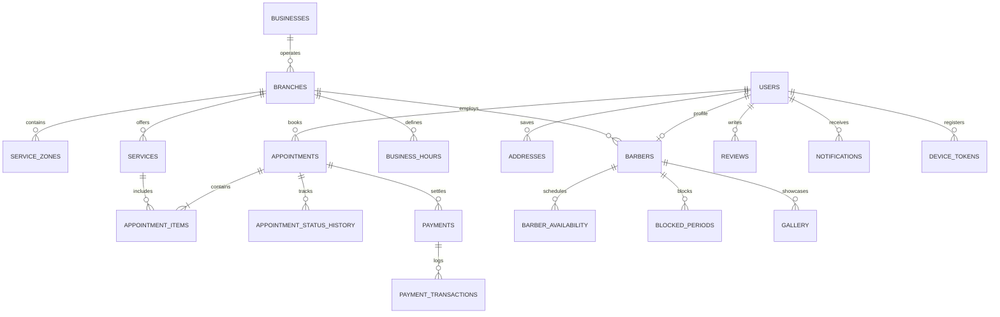

# Candycutz — Database Design & Entity Relational Model

## 1. Relational Model Overview
The Candycutz database is a normalized MySQL 8.0 relational schema utilizing InnoDB with UTF8mb4 character encoding. It is structured into 9 coherent domains supporting single and multi-branch operations, username-first identity, home services, Stripe payments, and CMS governance.

---

## 2. Entity Relational Diagram (Domain Map)

---

## 3. Detailed Entity Dictionary (24 Normalized Tables)

### Domain 1: Enterprise & Geographic Hierarchy
1. **`businesses`**
   - `id` (BIGINT UNSIGNED, PK, AUTO_INCREMENT)
   - `name` (VARCHAR(255), NOT NULL) — e.g. "Candycutz Enterprise"
   - `legal_name` (VARCHAR(255), NULL)
   - `phone` (VARCHAR(30), NULL)
   - `email` (VARCHAR(255), NULL)
   - `logo` (VARCHAR(255), NULL)
   - `created_at`, `updated_at` (TIMESTAMP)

2. **`branches`**
   - `id` (BIGINT UNSIGNED, PK, AUTO_INCREMENT)
   - `business_id` (BIGINT UNSIGNED, FK -> businesses.id)
   - `name` (VARCHAR(255), NOT NULL) — e.g. "Keffi Central Branch"
   - `slug` (VARCHAR(100), UNIQUE, NOT NULL) — "keffi-central"
   - `address` (TEXT, NOT NULL) — "Angwan Kare, BCG, Beside Angwan Kare BCG Gas Station..."
   - `latitude` (DECIMAL(10, 8), NOT NULL) — ~8.84710000
   - `longitude` (DECIMAL(11, 8), NOT NULL) — ~7.87360000
   - `phone` (VARCHAR(30), NOT NULL)
   - `email` (VARCHAR(255), NOT NULL)
   - `is_active` (BOOLEAN, DEFAULT TRUE)
   - `created_at`, `updated_at` (TIMESTAMP)

3. **`service_zones`**
   - `id` (BIGINT UNSIGNED, PK, AUTO_INCREMENT)
   - `branch_id` (BIGINT UNSIGNED, FK -> branches.id)
   - `name` (VARCHAR(150), NOT NULL) — "Keffi Central & Campus Zone"
   - `description` (TEXT, NULL)
   - `boundary_polygon` (JSON, NULL) — GeoJSON boundary coordinates
   - `radius_km` (DECIMAL(6, 2), DEFAULT 15.00)
   - `base_travel_fee` (DECIMAL(10, 2), DEFAULT 2000.00) — in NGN
   - `per_km_fee` (DECIMAL(10, 2), DEFAULT 150.00)
   - `is_active` (BOOLEAN, DEFAULT TRUE)
   - `created_at`, `updated_at` (TIMESTAMP)

### Domain 2: Identity & Addresses
4. **`users`**
   - `id` (BIGINT UNSIGNED, PK, AUTO_INCREMENT)
   - `username` (VARCHAR(30), UNIQUE, NULL) — e.g. "johndoe" (case-insensitive indexed)
   - `real_name` (VARCHAR(255), NOT NULL)
   - `email` (VARCHAR(255), UNIQUE, NOT NULL)
   - `password` (VARCHAR(255), NULL) — Nullable for social logins
   - `role` (ENUM('super_admin', 'admin', 'barber', 'customer'), NOT NULL)
   - `avatar` (VARCHAR(255), NULL)
   - `phone` (VARCHAR(30), NULL)
   - `auth_provider` (VARCHAR(50), NULL) — 'local', 'google', 'apple'
   - `provider_id` (VARCHAR(150), NULL)
   - `status` (ENUM('active', 'deactivated', 'suspended'), DEFAULT 'active')
   - `is_active` (BOOLEAN, DEFAULT TRUE)
   - `last_username_change_at` (TIMESTAMP, NULL)
   - `deactivated_at` (TIMESTAMP, NULL)
   - `remember_token` (VARCHAR(100), NULL)
   - `deleted_at` (TIMESTAMP, NULL)
   - `created_at`, `updated_at` (TIMESTAMP)

5. **`addresses`**
   - `id` (BIGINT UNSIGNED, PK, AUTO_INCREMENT)
   - `user_id` (BIGINT UNSIGNED, FK -> users.id)
   - `title` (VARCHAR(100), DEFAULT 'Home') — 'Home', 'Office', 'Hostel'
   - `street` (TEXT, NOT NULL)
   - `landmark` (VARCHAR(255), NULL)
   - `city` (VARCHAR(100), DEFAULT 'Keffi')
   - `state` (VARCHAR(100), DEFAULT 'Nasarawa')
   - `postal_code` (VARCHAR(20), DEFAULT '961101')
   - `latitude` (DECIMAL(10, 8), NULL)
   - `longitude` (DECIMAL(11, 8), NULL)
   - `is_default` (BOOLEAN, DEFAULT FALSE)
   - `created_at`, `updated_at` (TIMESTAMP)

### Domain 3: Barbers & Working Parameters
6. **`barbers`**
   - `id` (BIGINT UNSIGNED, PK, AUTO_INCREMENT)
   - `user_id` (BIGINT UNSIGNED, UNIQUE, FK -> users.id)
   - `branch_id` (BIGINT UNSIGNED, FK -> branches.id)
   - `bio` (TEXT, NULL)
   - `specialties` (JSON, NULL)
   - `rating` (DECIMAL(3, 2), DEFAULT 5.00)
   - `experience_years` (INT, DEFAULT 0)
   - `is_available` (BOOLEAN, DEFAULT TRUE)
   - `is_home_service_ready` (BOOLEAN, DEFAULT TRUE)
   - `status` (VARCHAR(30), DEFAULT 'active')
   - `deleted_at` (TIMESTAMP, NULL)
   - `created_at`, `updated_at` (TIMESTAMP)

7. **`business_hours`**
   - `id` (BIGINT UNSIGNED, PK, AUTO_INCREMENT)
   - `branch_id` (BIGINT UNSIGNED, FK -> branches.id)
   - `day_of_week` (TINYINT, NOT NULL) — 0 (Sunday) to 6 (Saturday)
   - `open_time` (TIME, NOT NULL)
   - `close_time` (TIME, NOT NULL)
   - `is_open` (BOOLEAN, DEFAULT TRUE)
   - `created_at`, `updated_at` (TIMESTAMP)

8. **`barber_availability`**
   - `id` (BIGINT UNSIGNED, PK, AUTO_INCREMENT)
   - `barber_id` (BIGINT UNSIGNED, FK -> barbers.id)
   - `day_of_week` (TINYINT, NOT NULL)
   - `start_time` (TIME, NOT NULL)
   - `end_time` (TIME, NOT NULL)
   - `is_available` (BOOLEAN, DEFAULT TRUE)
   - `created_at`, `updated_at` (TIMESTAMP)

9. **`blocked_periods`**
   - `id` (BIGINT UNSIGNED, PK, AUTO_INCREMENT)
   - `barber_id` (BIGINT UNSIGNED, FK -> barbers.id)
   - `branch_id` (BIGINT UNSIGNED, FK -> branches.id)
   - `start_datetime` (DATETIME, NOT NULL)
   - `end_datetime` (DATETIME, NOT NULL)
   - `reason` (VARCHAR(255), NULL)
   - `created_by` (BIGINT UNSIGNED, FK -> users.id)
   - `created_at`, `updated_at` (TIMESTAMP)

10. **`holidays`**
    - `id` (BIGINT UNSIGNED, PK, AUTO_INCREMENT)
    - `branch_id` (BIGINT UNSIGNED, NULL, FK -> branches.id)
    - `barber_id` (BIGINT UNSIGNED, NULL, FK -> barbers.id)
    - `date` (DATE, NOT NULL)
    - `reason` (VARCHAR(255), NOT NULL)
    - `created_at`, `updated_at` (TIMESTAMP)

### Domain 4: Service Catalog
11. **`service_categories`**
    - `id` (BIGINT UNSIGNED, PK, AUTO_INCREMENT)
    - `branch_id` (BIGINT UNSIGNED, NULL, FK -> branches.id)
    - `name` (VARCHAR(150), NOT NULL)
    - `slug` (VARCHAR(150), UNIQUE, NOT NULL)
    - `description` (TEXT, NULL)
    - `icon` (VARCHAR(100), NULL)
    - `sort_order` (INT, DEFAULT 0)
    - `is_active` (BOOLEAN, DEFAULT TRUE)
    - `created_at`, `updated_at` (TIMESTAMP)

12. **`services`**
    - `id` (BIGINT UNSIGNED, PK, AUTO_INCREMENT)
    - `branch_id` (BIGINT UNSIGNED, NULL, FK -> branches.id)
    - `category_id` (BIGINT UNSIGNED, FK -> service_categories.id)
    - `name` (VARCHAR(200), NOT NULL)
    - `slug` (VARCHAR(200), UNIQUE, NOT NULL)
    - `description` (TEXT, NULL)
    - `image` (VARCHAR(255), NULL)
    - `price` (DECIMAL(10, 2), NOT NULL)
    - `duration_minutes` (INT, NOT NULL DEFAULT 30)
    - `home_service_allowed` (BOOLEAN, DEFAULT TRUE)
    - `is_available` (BOOLEAN, DEFAULT TRUE)
    - `is_featured` (BOOLEAN, DEFAULT FALSE)
    - `deleted_at` (TIMESTAMP, NULL)
    - `created_at`, `updated_at` (TIMESTAMP)

13. **`barber_services`**
    - `id` (BIGINT UNSIGNED, PK, AUTO_INCREMENT)
    - `barber_id` (BIGINT UNSIGNED, FK -> barbers.id)
    - `service_id` (BIGINT UNSIGNED, FK -> services.id)
    - `custom_price` (DECIMAL(10, 2), NULL)
    - `custom_duration` (INT, NULL)
    - `is_offered` (BOOLEAN, DEFAULT TRUE)
    - `created_at`, `updated_at` (TIMESTAMP)

### Domain 5: Booking Core
14. **`appointments`**
    - `id` (BIGINT UNSIGNED, PK, AUTO_INCREMENT)
    - `booking_reference` (VARCHAR(30), UNIQUE, NOT NULL) — e.g. "CC-2026-X892B"
    - `branch_id` (BIGINT UNSIGNED, FK -> branches.id)
    - `customer_id` (BIGINT UNSIGNED, FK -> users.id)
    - `barber_id` (BIGINT UNSIGNED, FK -> barbers.id)
    - `appointment_type` (ENUM('in_shop', 'home_service'), NOT NULL DEFAULT 'in_shop')
    - `service_zone_id` (BIGINT UNSIGNED, NULL, FK -> service_zones.id)
    - `customer_address_id` (BIGINT UNSIGNED, NULL, FK -> addresses.id)
    - `appointment_date` (DATE, NOT NULL)
    - `start_time` (TIME, NOT NULL)
    - `end_time` (TIME, NOT NULL)
    - `total_duration_minutes` (INT, NOT NULL)
    - `total_amount` (DECIMAL(10, 2), NOT NULL)
    - `travel_fee` (DECIMAL(10, 2), DEFAULT 0.00)
    - `tip_amount` (DECIMAL(10, 2), DEFAULT 0.00)
    - `discount_amount` (DECIMAL(10, 2), DEFAULT 0.00)
    - `grand_total` (DECIMAL(10, 2), NOT NULL)
    - `status` (ENUM('pending', 'confirmed', 'checked_in', 'in_progress', 'completed', 'cancelled', 'no_show'), DEFAULT 'pending')
    - `cancellation_reason` (TEXT, NULL)
    - `notes` (TEXT, NULL)
    - `deleted_at` (TIMESTAMP, NULL)
    - `created_at`, `updated_at` (TIMESTAMP)

15. **`appointment_items`**
    - `id` (BIGINT UNSIGNED, PK, AUTO_INCREMENT)
    - `appointment_id` (BIGINT UNSIGNED, FK -> appointments.id ON DELETE CASCADE)
    - `service_id` (BIGINT UNSIGNED, FK -> services.id)
    - `price` (DECIMAL(10, 2), NOT NULL)
    - `duration_minutes` (INT, NOT NULL)
    - `created_at` (TIMESTAMP)

16. **`appointment_status_history`**
    - `id` (BIGINT UNSIGNED, PK, AUTO_INCREMENT)
    - `appointment_id` (BIGINT UNSIGNED, FK -> appointments.id ON DELETE CASCADE)
    - `previous_status` (VARCHAR(50), NULL)
    - `new_status` (VARCHAR(50), NOT NULL)
    - `changed_by_user_id` (BIGINT UNSIGNED, NULL, FK -> users.id)
    - `reason` (VARCHAR(255), NULL)
    - `created_at` (TIMESTAMP)

### Domain 6: Payments & Financial Ledger
17. **`payments`**
    - `id` (BIGINT UNSIGNED, PK, AUTO_INCREMENT)
    - `appointment_id` (BIGINT UNSIGNED, FK -> appointments.id)
    - `customer_id` (BIGINT UNSIGNED, FK -> users.id)
    - `amount` (DECIMAL(10, 2), NOT NULL)
    - `currency` (VARCHAR(10), DEFAULT 'NGN')
    - `status` (ENUM('pending', 'successful', 'failed', 'refunded'), DEFAULT 'pending')
    - `payment_method` (VARCHAR(50), DEFAULT 'stripe') — 'stripe', 'cash_at_shop', 'pos'
    - `stripe_payment_intent_id` (VARCHAR(150), NULL)
    - `stripe_charge_id` (VARCHAR(150), NULL)
    - `transaction_ref` (VARCHAR(100), UNIQUE, NOT NULL)
    - `receipt_url` (VARCHAR(255), NULL)
    - `error_message` (TEXT, NULL)
    - `created_at`, `updated_at` (TIMESTAMP)

18. **`payment_transactions`**
    - `id` (BIGINT UNSIGNED, PK, AUTO_INCREMENT)
    - `payment_id` (BIGINT UNSIGNED, FK -> payments.id)
    - `transaction_type` (ENUM('authorization', 'capture', 'refund', 'void'), NOT NULL)
    - `gateway` (VARCHAR(50), DEFAULT 'stripe')
    - `gateway_event_id` (VARCHAR(150), UNIQUE, NULL)
    - `amount` (DECIMAL(10, 2), NOT NULL)
    - `raw_payload` (JSON, NULL)
    - `status` (VARCHAR(50), NOT NULL)
    - `created_at` (TIMESTAMP)

### Domain 7: Reviews, Social & Showcase
19. **`reviews`**
    - `id` (BIGINT UNSIGNED, PK, AUTO_INCREMENT)
    - `appointment_id` (BIGINT UNSIGNED, NULL, FK -> appointments.id)
    - `customer_id` (BIGINT UNSIGNED, FK -> users.id)
    - `barber_id` (BIGINT UNSIGNED, FK -> barbers.id)
    - `service_id` (BIGINT UNSIGNED, NULL, FK -> services.id)
    - `rating` (TINYINT, NOT NULL) — 1 to 5
    - `comment` (TEXT, NOT NULL)
    - `is_approved` (BOOLEAN, DEFAULT TRUE)
    - `is_featured` (BOOLEAN, DEFAULT FALSE)
    - `created_at`, `updated_at` (TIMESTAMP)

20. **`gallery`**
    - `id` (BIGINT UNSIGNED, PK, AUTO_INCREMENT)
    - `barber_id` (BIGINT UNSIGNED, NULL, FK -> barbers.id)
    - `title` (VARCHAR(200), NOT NULL)
    - `category` (VARCHAR(100), DEFAULT 'fades')
    - `image_url` (VARCHAR(255), NOT NULL)
    - `description` (TEXT, NULL)
    - `is_featured` (BOOLEAN, DEFAULT FALSE)
    - `created_at`, `updated_at` (TIMESTAMP)

### Domain 8: CMS & Theme Studio
21. **`theme_settings`**
    - `id` (BIGINT UNSIGNED, PK, AUTO_INCREMENT)
    - `branch_id` (BIGINT UNSIGNED, NULL, FK -> branches.id)
    - `theme_name` (VARCHAR(100), DEFAULT 'CandyCutz Royal')
    - `tokens_json` (JSON, NOT NULL) — complete Light/Dark semantic token map
    - `status` (ENUM('draft', 'published', 'archived'), DEFAULT 'draft')
    - `created_at`, `updated_at` (TIMESTAMP)

22. **`theme_versions`**
    - `id` (BIGINT UNSIGNED, PK, AUTO_INCREMENT)
    - `theme_setting_id` (BIGINT UNSIGNED, FK -> theme_settings.id)
    - `version_number` (INT, NOT NULL)
    - `tokens_json` (JSON, NOT NULL)
    - `published_by_user_id` (BIGINT UNSIGNED, FK -> users.id)
    - `notes` (VARCHAR(255), NULL)
    - `created_at` (TIMESTAMP)

### Domain 9: Communications & Auditing
23. **`notifications`**
    - `id` (BIGINT UNSIGNED, PK, AUTO_INCREMENT)
    - `user_id` (BIGINT UNSIGNED, FK -> users.id)
    - `title` (VARCHAR(255), NOT NULL)
    - `message` (TEXT, NOT NULL)
    - `type` (ENUM('booking', 'payment', 'system', 'alert'), DEFAULT 'system')
    - `data` (JSON, NULL)
    - `is_read` (BOOLEAN, DEFAULT FALSE)
    - `read_at` (TIMESTAMP, NULL)
    - `created_at` (TIMESTAMP)

24. **`audit_logs`**
    - `id` (BIGINT UNSIGNED, PK, AUTO_INCREMENT)
    - `user_id` (BIGINT UNSIGNED, NULL, FK -> users.id)
    - `action` (VARCHAR(100), NOT NULL) — e.g. "appointment.override", "theme.publish"
    - `target_type` (VARCHAR(100), NULL)
    - `target_id` (BIGINT UNSIGNED, NULL)
    - `old_values` (JSON, NULL)
    - `new_values` (JSON, NULL)
    - `reason` (TEXT, NULL)
    - `ip_address` (VARCHAR(45), NULL)
    - `user_agent` (TEXT, NULL)
    - `created_at` (TIMESTAMP)
