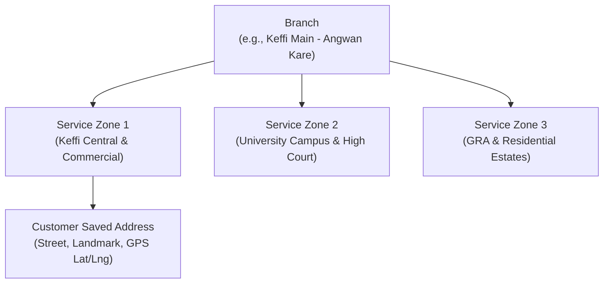

# Candycutz — Home Services & Geolocation Architecture

## 1. Vision & Operational Concept
Home service is a core tier of the Candycutz brand, not a future bolt-on. It provides an executive, VIP grooming experience at the customer's private residence, office, or hotel room in Keffi, Nasarawa State, Nigeria.

---

## 2. Relational Modeling for Geographic Expansion



The system is architected to prevent hardcoding a single shop address. As Candycutz adds service zones in Keffi or establishes branches in other cities (Lafia, Abuja), the schema automatically supports territory partitioning:
- `businesses`: Enterprise root.
- `branches`: Physical hub containing barbers, equipment, and local management.
- `service_zones`: Geographic radius or polygon with specific travel pricing and dispatch parameters.
- `addresses`: Customer saved delivery locations with coordinate points.

---

## 3. Travel Fee Calculation Algorithm

Travel fees are calculated dynamically on the server:
$$\text{Travel Fee} = \text{ZoneBaseFee} + (\text{DistanceInKm} \times \text{PerKmRate})$$

### 3.1 Haversine Distance Formula
```php
public function calculateTravelFee(ServiceZone $zone, float $customerLat, float $customerLng, float $branchLat, float $branchLng): float
{
    $earthRadius = 6371; // Kilometers

    $latDelta = deg2rad($customerLat - $branchLat);
    $lngDelta = deg2rad($customerLng - $branchLng);

    $a = sin($latDelta / 2) * sin($latDelta / 2) +
         cos(deg2rad($branchLat)) * cos(deg2rad($customerLat)) *
         sin($lngDelta / 2) * sin($lngDelta / 2);

    $c = 2 * atan2(sqrt($a), sqrt(1 - $a));
    $distanceKm = $earthRadius * $c;

    if ($distanceKm > $zone->radius_km) {
        throw new OutOfServiceZoneException("This location is outside our current Keffi delivery radius.");
    }

    $travelFee = $zone->base_travel_fee + ($distanceKm * $zone->per_km_fee);
    
    return round($travelFee, 2);
}
```

---

## 4. Location Privacy & Barber Security

To protect customer residential privacy and prevent unauthorized off-platform contact:
1. **Masking Window**:
   - The barber sees only the general neighborhood (e.g. *"Angwan Kare / High Court Area"*) until **2 hours prior** to the appointment start time.
   - At $T - 2\text{ hours}$, the full street address, landmark notes, and GPS navigation link (`https://maps.google.com/?q=lat,lng`) become visible in the Barber App.
2. **Post-Service Privacy Revocation**:
   - As soon as the appointment is marked `completed` or `cancelled`, the customer's exact street address and telephone number are redacted from the barber's active UI.
3. **Emergency Dispatch Support**:
   - Admins retain access to historical dispatch records in case of operational disputes.

---

## 5. Initial Keffi Service Zones

| Zone Name | Reference Landmarks | Base Travel Fee | Per-Km Fee | Radius |
|---|---|---|---|---|
| **Keffi Central** | BCG, Angwan Kare, Main Market, Total Filling Station | ₦2,000 | ₦100 | 5 km |
| **University Axis** | NSUK Main Campus, High Court, Pyanku, GRA | ₦3,000 | ₦150 | 12 km |
| **Outskirts Zone** | Akwanga Road Axis, Gidan Zakara, Keffi Bypass | ₦4,500 | ₦200 | 20 km |
