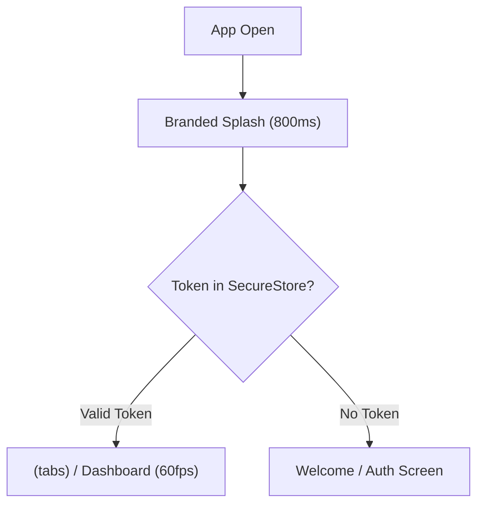

# Candycutz — Mobile Applications Architecture (Expo / React Native)

## 1. Overview & Mobile Strategy
Candycutz delivers two distinct, purpose-built native mobile applications:
1. **Candycutz Customer App** (`candycutz-customer-app`): Tailored for discovery, luxury booking, home-service scheduling, and personal style history.
2. **Candycutz Barber App** (`candycutz-barber-app`): An operational command cockpit for chair management, daily queue pacing, client identity recognition, and portfolio showcase.

Neither app is a WebView. Both are engineered with **React Native**, **Expo SDK 51+**, **Expo Router**, **TypeScript**, **TanStack Query v5**, and **NativeWind v4**.

---

## 2. Launch Experience & Session Pacing

### 2.1 First-Time Launch (Onboarding)
- Visual presentation: Deep obsidian canvas, champagne gold branding, animated fade-in.
- Tagline: *"Your style. Your barber. Your time."*
- Primary Action: `[ Get Started ]` → Seamless transition to login / registration.

### 2.2 Subsequent App Openings (Fast Return Launch)
- Avoids repetitive onboarding.
- Displays a branded 800ms luxury splash screen with gold monogram pulse.
- Evaluates `expo-secure-store` for cached bearer token.
- If authenticated: Immediately mounts `(tabs)/index.tsx`.
- If unauthenticated: Mounts welcome/login screen.

---

## 3. Customer Mobile Application Architecture

### 3.1 Core Navigation Structure (`(tabs)`)
- **Home (`index.tsx`)**:
  - Greeting with `@username`.
  - Next upcoming appointment card with countdown timer.
  - Quick action: "Book In-Shop" or "Request Home Service".
  - Featured barbers and trending haircut styles.
- **Bookings (`bookings.tsx`)**:
  - Filter segmented tabs: `Upcoming`, `Past`, `Cancelled`.
  - Actions: Reschedule, Cancel, View Directions, Rate & Review.
- **Explore (`explore.tsx`)**:
  - Master barber catalog with ratings, specialties, and years of experience.
  - Interactive portfolio gallery with high-resolution haircut photos.
- **Profile (`profile.tsx`)**:
  - Public display: `@username`, avatar, loyalty status.
  - Saved addresses management (Home, Office, University).
  - Appearance setting: Light, Dark, System.
  - Account security and soft deactivation options.

### 3.2 Booking Stepper Flow (`app/book/[serviceId].tsx`)
1. **Service Summary**: Displays price, duration, and optional add-on services.
2. **Location Choice**: Select `In-Shop` (Keffi Salon) or `Home Service`.
3. **Address Selector (If Home Service)**: Choose saved address or drop pin on map.
4. **Barber Picker**: Select preferred barber or "Any Available Master".
5. **Date & Slot Carousel**: Live query to `GET /api/v1/public/available-slots`.
6. **Payment Sheet**: Native Stripe Sheet (Cards, Apple Pay, Google Pay).

---

## 4. Barber Mobile Application Architecture

### 4.1 Core Navigation Structure (`(tabs)`)
- **Dashboard (`index.tsx`)**:
  - Today's date and total appointment load.
  - Active Client Card (Current customer in chair).
  - Immediate Status Stepper: `[ Check In ]` → `[ Start Service ]` → `[ Complete ]` / `[ No Show ]`.
  - Quick Walk-In Button: Instantly occupy chair for unannounced clients.
- **Schedule (`schedule.tsx`)**:
  - Weekly availability editor (Monday - Saturday).
  - "Block Time" modal: Select future hours for prayer, lunch, or personal leave.
- **Appointments (`appointments.tsx`)**:
  - Full upcoming client calendar.
  - Client detail viewer (Customer display `@username`, requested services, notes).
  - Home-service address unmasked 2 hours prior with one-tap Google Maps directions.
- **Profile (`profile.tsx`)**:
  - Barber bio, specialty tags editor, upload haircut to portfolio gallery.

---

## 5. Offline Caching & Emerging Network Handling
- **TanStack Query**:
  - `staleTime: 1000 * 60 * 5` (5 minutes for public catalogs).
  - `gcTime: 1000 * 60 * 60 * 24` (24-hour cache persistence).
- **Network Awareness**:
  - Integrated with `@react-native-community/netinfo`.
  - Offline banner appears when connection drops: *"Offline Mode — Browsing cached styles. Reconnect to book."*
  - Mutating forms (booking, payment) disable submit button and alert user if offline, preventing silent request timeouts.
- **Idempotency**:
  - Client generates UUID v4 for all booking mutations; sent via `X-Idempotency-Key` header so network retries never create duplicate appointments.
