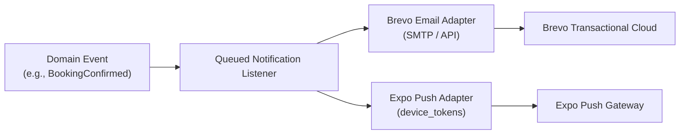

# Candycutz — Notifications & Brevo Email Architecture

## 1. Event-Driven Messaging Concept
Laravel owns the domain events. Brevo owns transactional email delivery. Expo owns native push notification dispatch. The business logic is decoupled through asynchronous events and queue listeners.



---

## 2. Notification Catalogs & Lifecycle Events

### 2.1 Customer Notifications
| Trigger Event | Brevo Transactional Email | Native Push Notification |
|---|---|---|
| **Account Created** | Welcome to Candycutz & Verification Link | "Welcome to Candycutz! Claim your style." |
| **Username Changed** | Notice of Username Modification | "Your @username has been successfully updated." |
| **Password Changed** | Security Alert: Password Updated | "Security Alert: Password changed." |
| **Booking Created** | Booking Awaiting Confirmation | "Booking received for [Service]." |
| **Payment Confirmed** | Booking Confirmed + Official Receipt | "Confirmed! [Barber] is reserved for you." |
| **Booking Rescheduled** | Reschedule Notice + Updated Time | "Your appointment was moved to [Date]." |
| **Booking Cancelled** | Cancellation Confirmation + Refund Info | "Appointment cancelled. Refund processing." |
| **2-Hour Reminder** | "Your appointment is in 2 hours!" | "Get ready! Marcus is expecting you in 2h." |
| **Appointment Done** | Thank You + Rate Your Barber Link | "How was your fade? Rate your experience!" |

### 2.2 Barber Notifications
| Trigger Event | Brevo Operational Email | Native Push Notification |
|---|---|---|
| **New Booking Assigned** | New Client Booked Alert | "New booking: [Service] at [Time] with @user" |
| **Client Rescheduled** | Client Rescheduled Notice | "Schedule update: @user rescheduled to [Time]" |
| **Client Cancelled** | Slot Released Alert | "Appointment cancelled: @user at [Time]" |
| **Home Service Dispatch** | Address Details Unmasked (T - 2h) | "Home service address unlocked! View directions." |

---

## 3. Brevo Adapter Implementation

```php
namespace App\Services\Notification;

use App\Models\Appointment;
use Illuminate\Support\Facades\Mail;

class BrevoNotificationAdapter
{
    public function sendBookingConfirmation(Appointment $appointment): void
    {
        $customer = $appointment->customer;
        $barber = $appointment->barber->user;

        $payload = [
            'booking_reference' => $appointment->booking_reference,
            'customer_name' => $customer->real_name,
            'barber_name' => $barber->real_name,
            'service_names' => $appointment->items->pluck('service.name')->join(', '),
            'appointment_date' => $appointment->appointment_date,
            'start_time' => $appointment->start_time,
            'total_amount' => number_format($appointment->grand_total, 2),
            'appointment_type' => $appointment->appointment_type === 'home_service' ? 'Home Service' : 'In-Shop',
        ];

        Mail::send('emails.booking_confirmation', $payload, function ($message) use ($customer, $appointment) {
            $message->to($customer->email, $customer->real_name)
                    ->subject("Booking Confirmed: {$appointment->booking_reference} — CandyCutz");
        });
    }
}
```

---

## 4. Push Notification Engine (Expo Push SDK)

Push notifications are delivered using the Expo Push Notifications API:
```php
public function sendPush(User $user, string $title, string $body, array $data = []): void
{
    $tokens = $user->deviceTokens()->pluck('token')->toArray();
    if (empty($tokens)) return;

    $messages = [];
    foreach ($tokens as $token) {
        $messages[] = [
            'to' => $token,
            'sound' => 'default',
            'title' => $title,
            'body' => $body,
            'data' => $data,
            'priority' => 'high',
        ];
    }

    Http::post('https://exp.host/--/api/v2/push/send', $messages);
}
```
