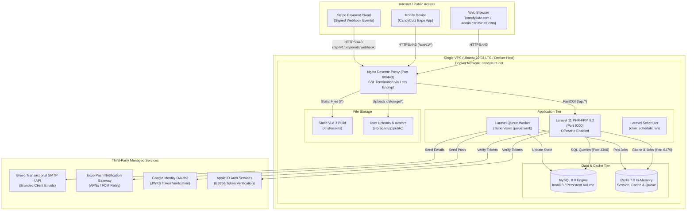
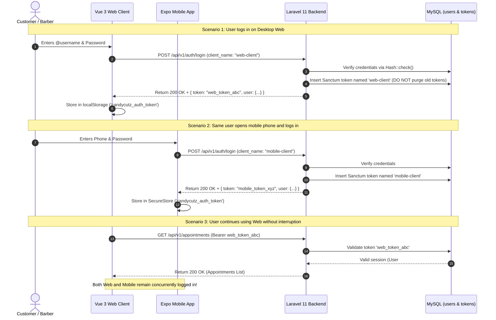
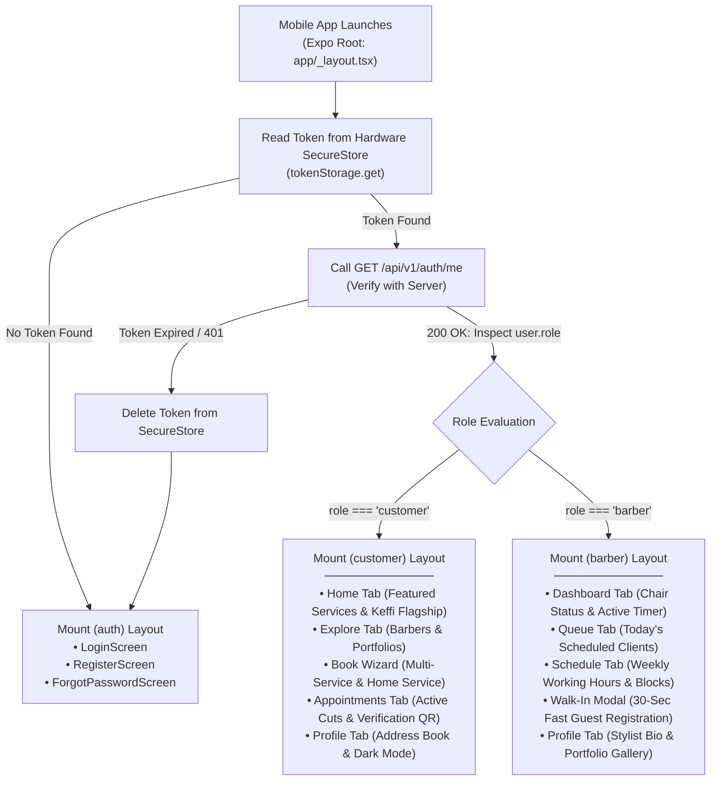

# Candycutz — System Diagrams & Visual Models

## 1. Physical Network & Single-VPS Production Topology

---

## 2. Multi-Device Authentication & Token Scoping Flow

---

## 3. Concurrency-Safe Booking Transaction Flow

```mermaid
sequenceDiagram
    autonumber
    actor Customer as Customer Client
    participant API as Laravel 11 Booking Engine
    participant DB as MySQL Database
    participant Stripe as Stripe Gateway
    participant Queue as Redis Queue Worker
    participant Brevo as Brevo Email Service

    Customer->>API: POST /api/v1/appointments<br/>{barber_id, date, start_time, services, mode}
    
    rect rgb(20, 20, 30)
        Note over API,DB: BEGIN DATABASE TRANSACTION
        API->>DB: SELECT * FROM appointments<br/>WHERE barber_id = ? AND date = ?<br/>AND (start_time < ? AND end_time > ?)<br/>FOR UPDATE
        alt Overlapping Appointment Exists
            DB-->>API: Row found (Conflict)
            API-->>Customer: 422 Conflict: "Slot unavailable"
            Note over API,DB: ROLLBACK TRANSACTION
        else No Overlapping Rows
            DB-->>API: 0 conflicting rows locked
            API->>DB: INSERT INTO appointments (status = 'pending_payment')
            API->>DB: INSERT INTO appointment_items (...)
            API->>DB: INSERT INTO appointment_status_history (...)
            API->>Stripe: Create PaymentIntent (amount, currency='NGN')
            Stripe-->>API: Return client_secret & intent_id
            API->>DB: INSERT INTO payments (status='pending', intent_id)
            Note over API,DB: COMMIT TRANSACTION
        end
    end

    API-->>Customer: 201 Created + {appointment, client_secret}

    Note over Customer,Brevo: Asynchronous Payment Webhook Settlement
    Customer->>Stripe: Confirms Card Authorization
    Stripe->>API: POST /api/v1/payments/webhook (payment_intent.succeeded)
    API->>API: Verify Stripe-Signature Header
    API->>DB: Check payment_transactions for duplicate event_id
    API->>DB: UPDATE payments SET status = 'successful'
    API->>DB: UPDATE appointments SET status = 'confirmed'
    API->>Queue: Dispatch SendBookingConfirmationJob(appointment_id)
    API-->>Stripe: 200 OK (Acknowledged)
    
    Queue->>Brevo: Send Luxury Branded Confirmation Email via SMTP
    Brevo-->>Customer: Deliver Email to Inbox
```

---

## 4. Unified Mobile App Role-Based Navigation Architecture

